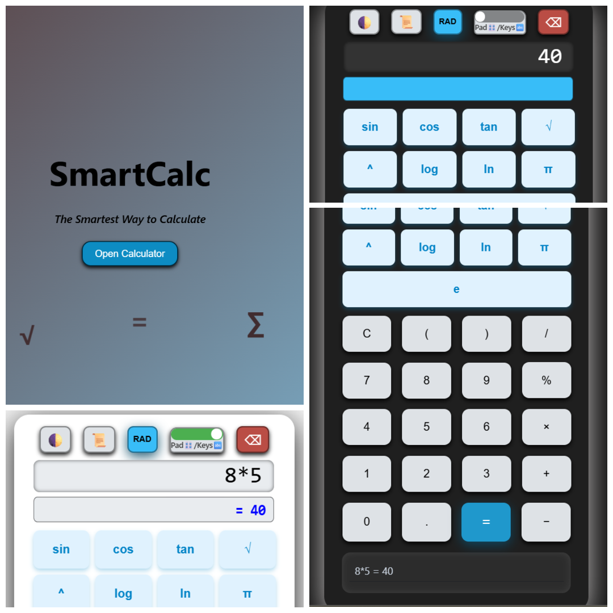

# 🚀 SmartCalc – The Smartest Way to Calculate

Welcome to **SmartCalc**, a modern, feature-rich, and visually stunning calculator app designed for both casual and advanced users. Whether you need basic arithmetic or advanced scientific calculations, SmartCalc has you covered with a seamless, interactive, and user-friendly experience.

---

## 🌟 Features

### 🎨 Beautiful & Responsive UI
- **Modern Design:** Elegant gradients, smooth animations, and floating math stickers for a delightful experience.
- **Responsive Layout:** Works perfectly on desktops, tablets, and mobile devices.

### 🌙 Dark Mode
- **Toggle Dark/Light Theme:** Instantly switch between dark and light modes for comfortable viewing day or night.

### 🧮 Scientific Calculator
- **Advanced Functions:** Supports `sin`, `cos`, `tan`, `log`, `ln`, `√`, powers (`^`), π, and e.
- **Parentheses & Order of Operations:** Easily handle complex expressions with brackets and operator precedence.

### 📏 Radian & Degree Modes
- **RAD/DEG Toggle:** Switch between radians and degrees for trigonometric calculations with a single click.

### 📝 Calculation History
- **History Panel:** View your last 10 calculations. Click any entry to reload it into the calculator for reuse or editing.
- **Toggle Visibility:** Show or hide the history panel as needed.

### ⌨️ Keyboard & On-Screen Input
- **Pad/Keys Switch:** Enable or disable keyboard typing for the input field. Use the on-screen buttons or your keyboard.
- **Backspace Button:** Easily delete the last character with a dedicated button or the Backspace key.

### ⚡ Real-Time Results
- **Live Calculation:** Instantly see the result of your current expression as you type, before pressing `=`.

### 🛡️ Input Safety & Feedback
- **Read-Only Mode:** Prevent accidental typing when using only the on-screen pad.
- **Toast Notifications:** Get instant feedback when toggling typing modes.

---

## 🛠️ How to Use SmartCalc

1. **Open the Calculator:**
   - by clicking on the 'Open Calculator' button.

2. **Enter Expressions:**
   - Use the on-screen buttons or your keyboard (if enabled) to enter numbers, operators, and functions.
   - Supported functions: `sin`, `cos`, `tan`, `log`, `ln`, `√`, `^`, `π`, `e`, parentheses, and all basic arithmetic.

3. **Switch Modes:**
   - **Dark Mode:** Click the 🌓 button to toggle between dark and light themes.
   - **History:** Click 📜 to show/hide your calculation history.
   - **Radians/Degrees:** Click the `RAD`/`DEG` button to switch trigonometric input modes.
   - **Pad/Keys:** Use the toggle switch to enable or disable keyboard typing for the input field.

4. **View Results:**
   - See real-time results below the input as you type.
   - Press `=` or Enter to calculate and update the display.

5. **Use History:**
   - Click any entry in the history panel to reload it into the calculator.

6. **Clear & Edit:**
   - Use `C` to clear the display.
   - Use the ⌫ button or Backspace key to delete the last character.

---

## 💡 Pro Tips

- **Scientific Functions:** For trigonometric functions, use the `RAD/DEG` toggle to match your input type.
- **Keyboard Shortcuts:** When typing is enabled, use Enter for `=`, Backspace to delete, and type directly into the input.
- **History Recall:** Quickly reuse or edit previous calculations by clicking on them in the history panel.

---

## 📦 Tech Stack

- **HTML5 & CSS3:** Modern, responsive, and animated UI.
- **JavaScript:** Interactive logic and feature-rich functionality.
- **[math.js](https://mathjs.org/):** Powerful math engine for accurate and advanced calculations.

---

## 🖼️ Screenshots

>  

---

## 📄 License

This project is for educational and personal use.

---

Enjoy using **SmartCalc** – the smartest way to calculate!